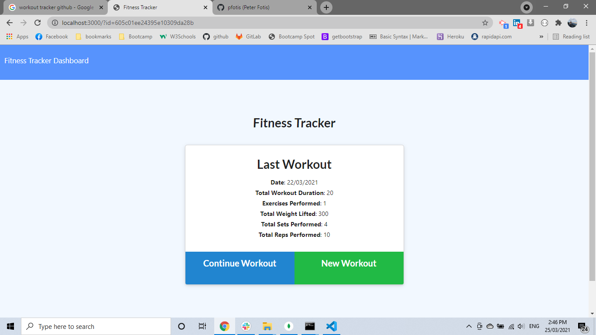
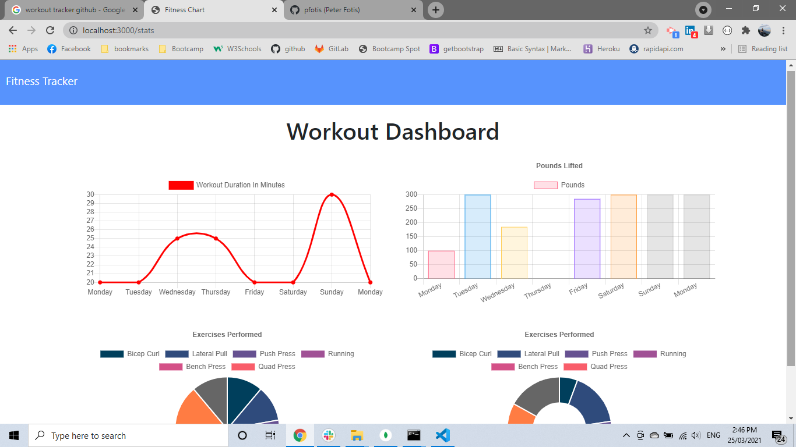
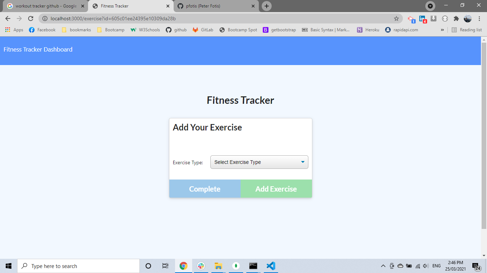
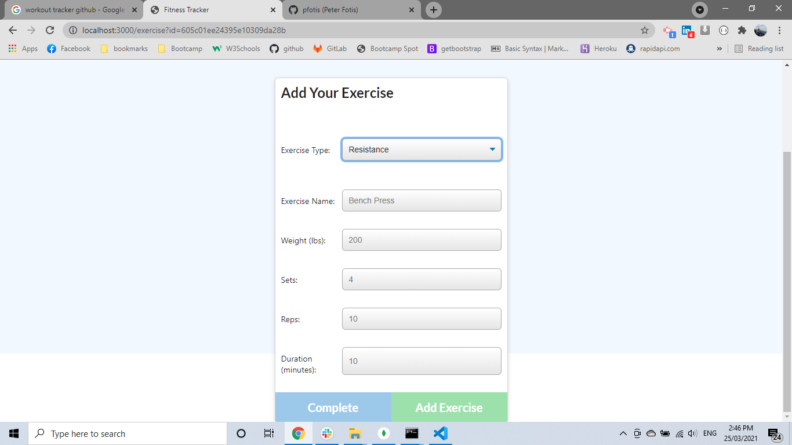
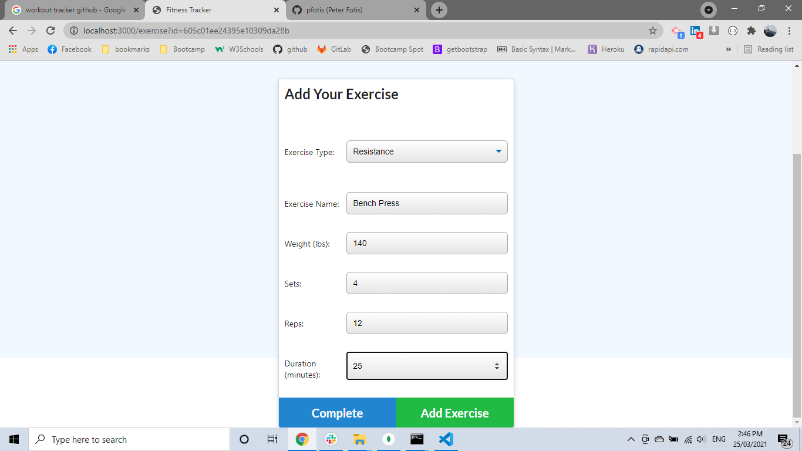

# workout-tracker

* [links](#links)
* [Installation](#installation)
* [Description](#description)
* [Tests](#tests)
* [Questions](#questions)

## links

    link of the repository :   https://github.com/pfotis/workout-tracker
    
    link of the webpage  :     

## Description

    Workout-Tracker is an application to support the user in his/her workout. In the main page the user could see the total time a spend for the last day use the app. At the page stats the user couls see with the help of the diagrams for every day the time spent or the pounds lift. And there is pies at the bottom of the same page to show the user where spend the time more or what lift more.

    At this application we use mongo database to store and restore  and update the data (workout).

## Installation

    npm install 

    npm run seed

## Tests

    With the following pictures the user could see the outfit of this project.

## Questions

    For any questions about this repository, please contact me at pfotis@gmail.com
    View my work in GitHub pfotis(https://github.com/pfotis)